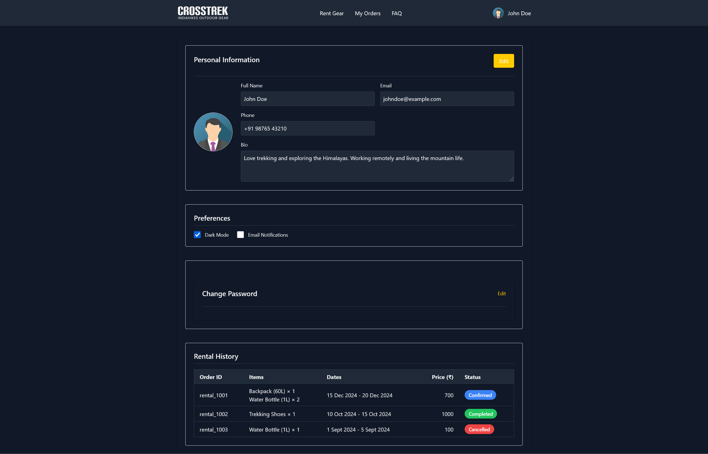

# 🏔️ Trek Rental – User Profile App

A **Next.js** app for managing user profiles, preferences, and viewing gear rental history — built with a clean UI, mock data, and smooth client-side state management.

---

## 🚀 Features

- ✅ View and edit **user profile** (name, phone, bio, photo)
- 🎛️ Toggle **preferences** like Dark Mode & Email Notifications
- 📦 View **rental history** with order details
- 🔐 Secure-style change password form with client-side validation
- 🧳 View available gear for rent for upcoming treks

---

## 🛠️ Tech Stack

- [Next.js 13+](https://nextjs.org/) (App Router)
- [React](https://reactjs.org/) – Client Components
- [Tailwind CSS](https://tailwindcss.com/) – utility-first styling
- [Zod](https://zod.dev/) for schema validation
- [Lucide React](https://lucide.dev/) for modern icons
- [TypeScript]
- 🔗 Deployed on [Vercel](https://vercel.com/)

---

## 📁 Folder Structure

```
/app
  /components
    ClientWrapper.tsx     → Wrapper for client-side components
    DarkmodeToggle.tsx    → Toggle switch for dark mode
    header.tsx            → Page header component

  /context
    DarkModeContext.tsx   → Context for dark mode state

  /faq
    page.tsx              → FAQ Page

  /profile              
    page.tsx              → User Profile page
    ChangePassword.tsx    → Password change form

  /rentals
    page.tsx              → Rental history page

  /rentgear
    page.tsx              → Rental gear listing page

  layout.tsx              → Main layout wrapper (used across pages)
  page.tsx                → Home Page

/lib
  mockData.ts             → Mock user profile and rental data
  rentalGear.ts           → Mock rental gear inventory

/public
  /images                 → Gear/product images

/styles
  globals.css             → Global CSS styles
```

---

## ⚙️ Getting Started

### 1. Clone the Repository

```bash
git clone https://github.com/LongShotRanger/UserProfile.git
cd UserProfile
```

### 2. Install Dependencies

```bash
npm install
# or
yarn
```

### 3. Start the Development Server

```bash
npm run dev
# or
yarn dev
```

Open your browser at **http://localhost:3000/profile**

---

## 📦 Deployment

This project is ready for **Vercel**:

1. Push your code to GitHub.
2. Visit [vercel.com](https://vercel.com) and import the repo.
3. Vercel auto-detects Next.js and deploys it instantly (for free 🚀).

🌐 Live Demo: : https://user-profile-git-main-vimleshrawats-projects.vercel.app/profile

---

## 📌 Notes

- Frontend-only: No backend or persistent database.
- Mock data is pulled from mockData.ts and rentalGear.ts.
- User updates (profile changes, preferences, etc.) are temporarily stored in localStorage to simulate a save-and-restore experience.
- Hydration handled via useEffect to sync client state (like dark mode) with server render.
- Built for extensibility — easy to plug in backend APIs & auth later.

---

## 📸 Preview

> 

---

## 🧠 Design Decisions

- Local state + localStorage to simulate update/save.
- Profile image is **preview-only** — not editable yet.
- Built with raw Tailwind CSS — no UI libraries for full control.
- Used Zod for runtime schema validation.
- Used Lucide React for consistent icon design.

---

## 🙌 Author

Made by **Vimlesh Rawat**